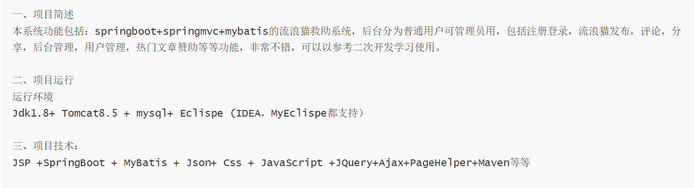
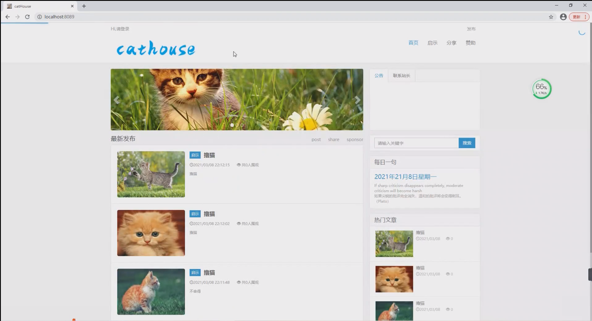
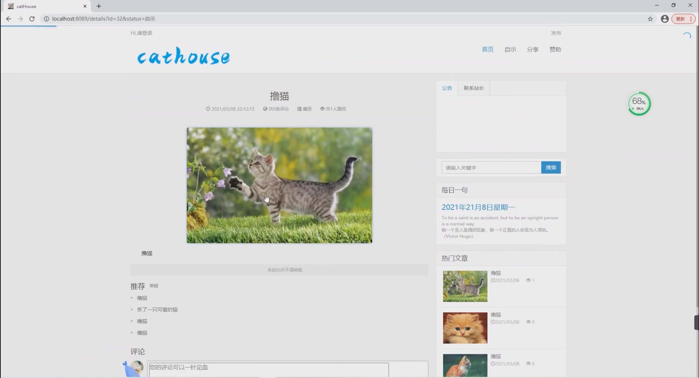
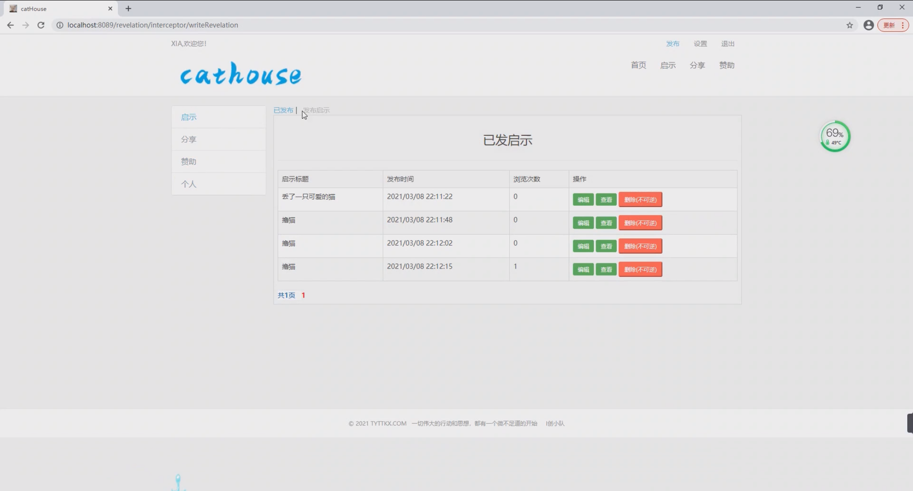
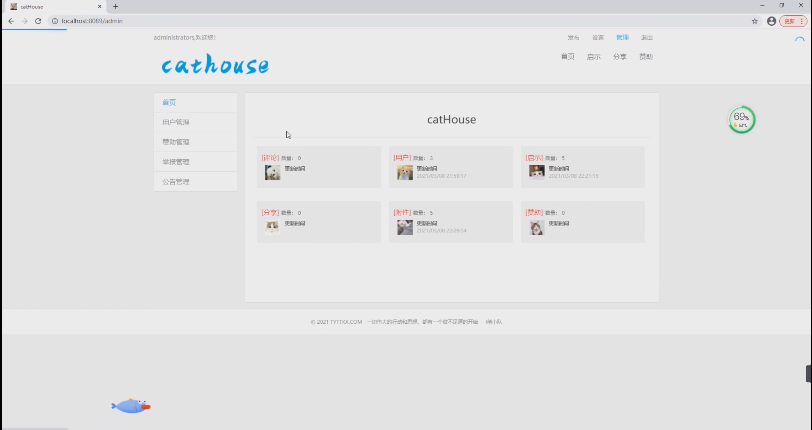
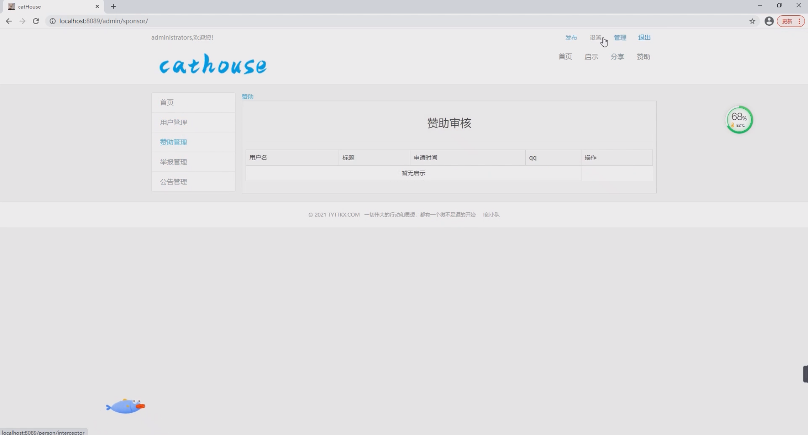

基于Springboot的浪猫救助系统
=
### 完整代码获取地址：从戎源码网 ([https://armycodes.com/](https://armycodes.com/))
### 作者微信：19941326836  QQ：952045282 
### 承接计算机毕业设计、Java毕业设计、Python毕业设计、深度学习、机器学习
### 选题+开题报告+任务书+程序定制+安装调试+论文+答辩ppt 一条龙服务
### 所有选题地址https://github.com/nature924/allProject

一、项目介绍
---
基于Springboot框架实现的流浪猫救助系统包含两种角色：管理员、用户,系统分为前台和后台两大模块，主要功能如下。

### 【用户模块】：
1. 发布：用户可以发布流浪猫的信息，包括照片、地点、情况等，以寻求帮助和救助。
2. 启示：用户可以发布启示广告，帮助寻找流浪猫的主人或寻找有意领养的人。
3. 分享：用户可以分享自己救助流浪猫的经历和方法，为其他用户提供参考。
4. 赞助：用户可以向流浪猫救助组织提供赞助，支持他们救助和照顾流浪猫。
5. 个人：用户可以管理自己的个人信息，包括查看、编辑、删除等操作。

### 【管理员模块】：
1. 管理：管理员可以管理流浪猫救助系统的首页内容，包括发布、编辑、删除等操作。
2. 用户管理：管理员可以管理系统的用户信息，包括查看、编辑、删除等操作。
3. 赞助管理：管理员可以管理系统的赞助信息，包括查看、编辑、删除等操作。
4. 举报管理：管理员可以管理用户对不良信息的举报，包括查看、处理、删除等操作。
5. 公告管理：管理员可以发布系统公告，向用户传达重要信息。

二、项目技术
---
- 编程语言：Java
- 数据库：MySQL
- 项目管理工具：Maven
- 前端技术：VUE、HTML、Jquery、Bootstrap
- 后端技术：Spring、SpringMVC、MyBatis

三、运行环境
---
- 操作系统：Windows、macOS都可以
- JDK版本：JDK1.8以上都可以
- 开发工具：IDEA、Ecplise、Myecplise都可以
- 数据库: MySQL5.7以上都可以
- Tomcat：任意版本都可以
- Maven：任意版本都可以

四、运行截图
---

### 程序截图：

